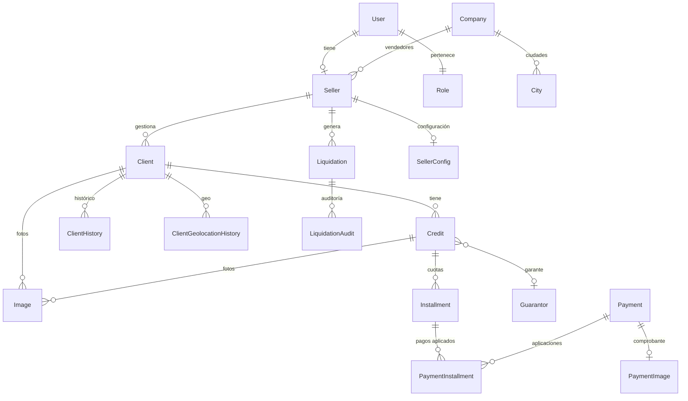

# 🏗️ Arquitectura del Backend - ControCD

Backend Laravel 11 con API REST + OAuth2 (Laravel Passport).

---

## 📂 Estructura del Proyecto

```
app/
├── Console/         # Comandos Artisan (14 comandos)
├── Exports/         # Exportaciones Excel (Maatwebsite)
├── Helpers/         # Funciones auxiliares
├── Http/
│   ├── Controllers/ # Controladores REST (22+)
│   ├── Middleware/  # Middlewares
│   └── Requests/    # Form Requests de validación
├── Mail/            # Mailables
├── Models/          # Modelos Eloquent (28)
├── Notifications/   # Notificaciones
├── Providers/       # Service Providers
├── Services/        # Capa de servicios (18)
└── Traits/          # Traits reutilizables
```

---

## 📊 Modelos de Datos

### Diagrama de Relaciones Principal



### Modelos Principales

| Modelo               | Tabla                  | Descripción                         |
| -------------------- | ---------------------- | ----------------------------------- |
| `User`               | `users`                | Usuarios del sistema                |
| `Seller`             | `sellers`              | Vendedores/cobradores               |
| `Client`             | `clients`              | Clientes                            |
| `Credit`             | `credits`              | Créditos otorgados                  |
| `Installment`        | `installments`         | Cuotas del crédito                  |
| `Payment`            | `payments`             | Pagos realizados                    |
| `PaymentInstallment` | `payment_installments` | Relación pago-cuota                 |
| `Liquidation`        | `liquidations`         | Liquidaciones diarias               |
| `Expense`            | `expenses`             | Gastos del vendedor                 |
| `Income`             | `incomes`              | Ingresos adicionales                |
| `Guarantor`          | `guarantors`           | Garantes de créditos                |
| `Image`              | `images`               | Imágenes de clientes/créditos       |
| `Company`            | `companies`            | Empresas                            |
| `City`               | `cities`               | Ciudades                            |
| `Role`               | `roles`                | Roles de usuario                    |
| `SellerConfig`       | `seller_configs`       | Configuración por vendedor          |
| `LiquidationAudit`   | `liquidation_audits`   | Historial de cambios en liquidación |

---

## 🔧 Servicios (Capa de Negocio)

### Servicios Principales por Tamaño

| Servicio             | Tamaño  | Responsabilidad                           |
| -------------------- | ------- | ----------------------------------------- |
| `ClientService`      | ~140 KB | CRUD clientes, búsqueda, estadísticas     |
| `LiquidationService` | ~79 KB  | Liquidaciones, cálculos, auto-liquidación |
| `CreditService`      | ~72 KB  | Créditos, cuotas, renovaciones            |
| `PaymentService`     | ~58 KB  | Pagos, distribución, idempotencia         |
| `DashboardService`   | ~50 KB  | Estadísticas, métricas, reportes          |
| `SellerService`      | ~30 KB  | Gestión de vendedores, cartera            |
| `ExpenseService`     | ~20 KB  | Gastos del vendedor                       |
| `IncomeService`      | ~20 KB  | Ingresos adicionales                      |
| `UserService`        | ~19 KB  | Usuarios, autenticación                   |
| `CompanyService`     | ~10 KB  | Empresas, configuración                   |

### Servicios de Soporte

| Servicio                    | Responsabilidad           |
| --------------------------- | ------------------------- |
| `LoginService`              | Autenticación OAuth2      |
| `CitiesService`             | Ciudades, departamentos   |
| `CountriesService`          | Países                    |
| `GuarantorService`          | Garantes                  |
| `RoleService`               | Roles                     |
| `InstallmentService`        | Cuotas individuales       |
| `SellerConfigService`       | Configuración de vendedor |
| `GeolocationHistoryService` | Historial GPS de clientes |

---

## 🛤️ Endpoints API Principales

### Autenticación

```
POST   /api/login               # Login (OAuth2)
POST   /api/logout              # Logout
POST   /api/refresh             # Refrescar token
```

### Clientes

```
GET    /api/clients             # Listar clientes
GET    /api/clients/{uuid}      # Detalle por UUID
POST   /api/client/create       # Crear cliente
PUT    /api/client/update/{id}  # Actualizar
DELETE /api/client/delete/{id}  # Eliminar (soft)
GET    /api/clients/seller/{id} # Clientes por vendedor
```

### Créditos

```
GET    /api/credits             # Listar créditos
POST   /api/credit/create       # Crear crédito
POST   /api/credit/renew/{id}   # Renovar crédito
PUT    /api/credit/update/{id}  # Actualizar
```

### Pagos

```
GET    /api/payments            # Listar pagos
POST   /api/payment/create      # Registrar pago
GET    /api/payments/today/{id} # Pagos del día por vendedor
```

### Liquidaciones

```
GET    /api/liquidations        # Listar liquidaciones
POST   /api/liquidation/create  # Crear liquidación
PUT    /api/liquidation/approve # Aprobar liquidación
GET    /api/liquidation/seller/{id}/date/{date}
```

### Dashboard

```
GET    /api/dashboard           # Estadísticas generales
GET    /api/dashboard/seller/{id} # Dashboard vendedor
```

---

## 🔐 Autenticación (Laravel Passport)

### Flujo OAuth2

1. Cliente envía credenciales a `/api/login`
2. Se valida contra `users` table
3. Se genera `access_token` y `refresh_token`
4. Token se envía en header: `Authorization: Bearer {token}`

### Middleware de Autenticación

```php
Route::middleware('auth:api')->group(function () {
    // Rutas protegidas
});
```

---

## ⏰ Comandos Artisan (Crons)

### Comandos de Liquidación

| Comando                      | Horario | Descripción                       |
| ---------------------------- | ------- | --------------------------------- |
| `liquidation:notify-pending` | 21:52   | Notifica liquidaciones pendientes |
| `liquidation:auto-daily`     | 23:55   | Auto-liquidación diaria           |
| `liquidation:historical`     | 23:55   | Liquidaciones históricas          |

### Configuración Cron

```bash
* * * * * cd /var/www/controlcd-api && php artisan schedule:run >> /dev/null 2>&1
```

---

## 🔄 Patrones de Diseño

### Service Layer Pattern

```php
// Controller delega a Service
class PaymentController extends Controller
{
    public function create(Request $request)
    {
        $result = PaymentService::create($request);
        return response()->json($result);
    }
}
```

### Transacciones con Idempotencia

```php
public static function create($request)
{
    // Verificar idempotency key
    $key = $request->header('X-Idempotency-Key');
    if (Cache::has("payment:$key")) {
        return Cache::get("payment:$key");
    }

    DB::beginTransaction();
    try {
        $payment = Payment::create([...]);
        // Aplicar a cuotas
        DB::commit();
        Cache::put("payment:$key", $result, 3600);
        return $result;
    } catch (\Exception $e) {
        DB::rollBack();
        throw $e;
    }
}
```

### Soft Deletes

```php
class Client extends Model
{
    use SoftDeletes;
    // deleted_at column para eliminación lógica
}
```

---

## 📤 Exportaciones

### Maatwebsite Excel

-   `ClientsExport` - Exportar clientes
-   `CreditsExport` - Exportar créditos
-   `PaymentsExport` - Exportar pagos
-   `LiquidationsExport` - Exportar liquidaciones

### PDFs (DomPDF)

-   Reportes de liquidación
-   Recibos de pago
-   Reportes de cartera

---

## 🛡️ Seguridad

### Implementado

-   ✅ OAuth2 con Laravel Passport
-   ✅ Rate Limiting
-   ✅ CORS configurado
-   ✅ Validación de requests
-   ✅ Soft deletes
-   ✅ Logging de acciones

### Roles

| Rol             | Permisos                               |
| --------------- | -------------------------------------- |
| `root`          | Acceso total                           |
| `super usuario` | Administración completa                |
| `administrador` | Gestión de vendedores y aprobaciones   |
| `vendedor`      | CRUD clientes, créditos, pagos propios |

---

## 📦 Dependencias Principales

```json
{
    "laravel/framework": "^11.x",
    "laravel/passport": "^12.x",
    "maatwebsite/excel": "^3.x",
    "dompdf/dompdf": "^2.x",
    "fruitcake/php-cors": "^1.x"
}
```

---

## 🚀 Scripts de Despliegue

```bash
# Deploy completo
./deploy-to-server.sh

# Deploy rápido (sin composer/migrations)
./quick-deploy.sh

# Limpiar cache
php artisan config:clear
php artisan cache:clear
php artisan route:clear
```

---

**Última actualización:** Diciembre 2025
**Mantenedor:** Mario Díaz
